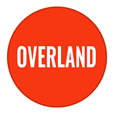

 

# Overland
## Web application framework for Node.js

Overland is an MVC web application framework inspired by Rails and Django, built on Koa 2.x and oriented toward rapid development using the latest features in JavaScript.

Overland doesn't re-invent the wheel -- if there's a module that performs a task well, Overland takes advantage of it -- Models and DB are provided by Objection.js and Knex, Rails-style routing is provided by Route-Mapper. Accordingly, Overland's core codebase is fairly svelte - in its current state, ~1500 lines.

Like in Django, Overland applications are split into 'apps,' self-contained applications that provide discrete bits of functionality.

## Getting Started
```
npm install -g ltd

ltd site test-site
ltd app test-app

cd test-site
ltd serve
```

## Models

Overland uses Objection.js for database support -- meaning you can any of Knex's supported databases out of the box. It also provides a user-friendly syntax for defining models and relationships, inspired by Django.

```typescript
import { Model } from 'overland/core';
import { User } from 'overland-auth/models';
import { register, title } from 'overland-admin/decorators';
import { StringField, DateTimeField, TextField, BelongsToOneField } from 'overland/db';

@register
export default class Post extends Model {
  @title
  static title = new StringField('Title');
  static posted = new DateTimeField('Date Posted');
  static updated = new DateTimeField('Last Updated');
  static summary = new TextField('Summary');
  static author = new BelongsToOneField('Author', User);
  static body = new TextField('Body text');
}
```

## Controllers
A controller subclasses Overland's Controller class and provides an arbitrary number of synchronous or asynchronous methods.

```typescript
import Post from '../models/Post';
import { Controller } from 'overland/core';

class PostsCtrl extends Controller {

  public async index(ctx) {
    const posts = await Post.query().select('summary').limit(10);
    ctx.body = await ctx.render({ data: { posts }});
  }

  public async create(ctx) {
    const { user, request } = ctx;
    const data = Object.assign({}, request.body, { user });
    const post = new Post(data);
    await post.save();
    ctx.body = await ctx.render({ post });
  }
}

export { PostCtrl as default };
```

## Routing and Configuration

```typescript
import { App, Router } from 'overland/core';
import { resolve } from 'path';
import PostCtrl from './controllers/PostCtrl';
import Post from './models/post';

const routes = new Router();
routes
  .get('/', { to: 'post#index' }
  .get('/create', { to: 'post#create' });

export default class BlogApp extends App {
  static label = 'Blog';
  static models = [ Post ];
  static controllers = [ PostCtrl ];
  static routes = appRouter;
  static views = resolve(__dirname, '../views');
}
```

Then in your site-wide router, you can import the App configuration and mount it with `Router#use()`.

Sites are configured using a Django-style `settings.js`. This includes middleware -- any Koa 2.x middleware will do! --the site router configuration, database configuration, view engine configuration and directories for assets and views.

```javascript
import Blog from 'blogApp';
import Auth from 'overland-auth';
import nunjucks from 'overland-nunjucks';
import { Router } from 'overland/core';
import { resolve } from 'path';

const routes = new Router();
routes.root('blog.post#index')
  .use('/posts', BlogApp.routes);

export default const settings = {
  apps: [ Auth, Blog ],
  middleware: [],
  routes,
  engine: nunjucks,
  assets: resolve(__dirname, '../assets'),
  views: resolve(__dirname, '../views')
  databases: {
    development: {
      client: 'sqlite3',
      connection: {
        filename: resolve(__dirname, '../mydb.sqlite')
      }
    }
  }
};
```